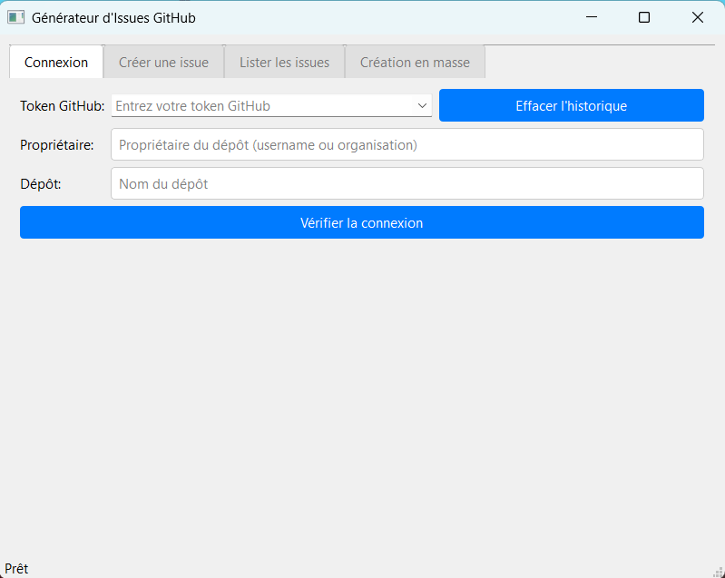
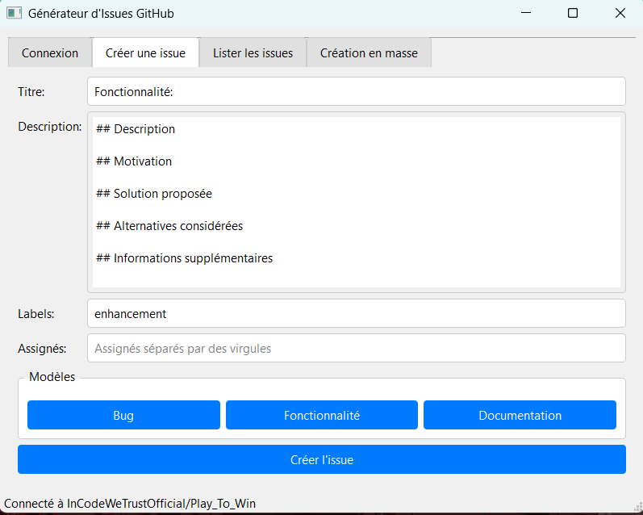
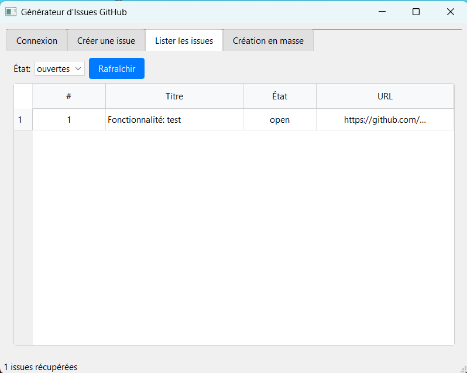

#  IssuesMaker

IssuesMaker est une application de bureau permettant de créer et gérer facilement des issues GitHub de manière individuelle ou en lot.

## 📥 Installation

Téléchargez simplement la dernière version de l'exécutable (.exe) depuis la page des [releases](https://github.com/Yota02/IssuesMaker/releases/tag/v1.0.0).

## 🖼️ Captures d'écran

### Connection avec Github

*Fenêtre principale de l'application*

### Création d'une issue

*Interface de création d'issue avec les modèles disponibles*

### Liste des Issues

*Liste des issues*

## 🚀 Utilisation

1. **Démarrage**
   - Lancez l'exécutable IssuesMaker.exe
   - Entrez votre token GitHub
   - Sélectionnez le dépôt cible

2. **Création d'une issue**
   - Choisissez un modèle (Bug, Fonctionnalité, Documentation)
   - Remplissez les champs
   - Ajoutez des labels et assignés
   - Cliquez sur "Créer"

3. **Mode lot**
   - Ajoutez plusieurs issues à la liste
   - Modifiez-les si nécessaire
   - Créez toutes les issues en un clic

## 🔧 Fonctionnalités principales

- ✨ Interface graphique intuitive
- 📝 Modèles d'issues prédéfinis
- 🏷️ Gestion des labels et assignés
- 📦 Création d'issues en lot
- 💾 Sauvegarde des configurations
- 🔄 Historique des tokens GitHub

## 📄 Licence

Ce projet est sous licence MIT - voir le fichier [LICENSE](LICENSE) pour plus de détails.

## 🤝 Contribution

Les contributions sont les bienvenues ! N'hésitez pas à :
- Ouvrir une issue pour un bug ou une suggestion
- Proposer une pull request
- Améliorer la documentation